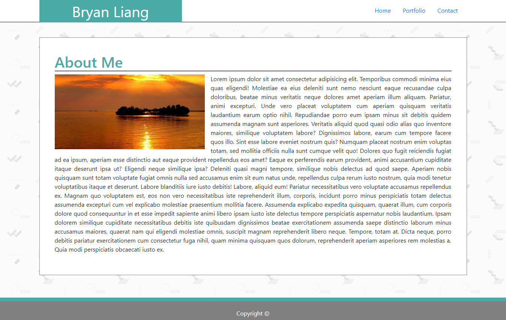
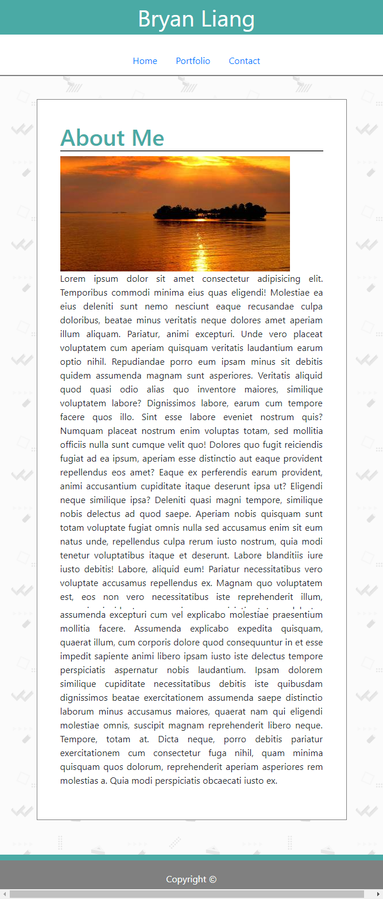

<!-- Put the name of the project after the # -->
<!-- the # means h1  -->
# Bootstrap Portfolio

<!-- Put a description of what the project is -->
Building a professional portfolio while learning how to use the Bootstrap grid system and media queries in CSS.

# Link to Deployed Site
<!-- make a link to the deployed site --> 
<!-- [What the user will see](the link to the deployed site) -->
[Bootstrap Portfolio](https://liangbryan2.github.io/Bootstrap-Portfolio/)

# Images
<!-- take a picture of the image and add it into the readme  -->
<!--  -->


# Technology Used
<!-- make a list of technology used -->
<!-- what you used for this web app, like html css -->


<!-- 
1. First ordered list item
2. Another item
⋅⋅* Unordered sub-list. 
1. Actual numbers don't matter, just that it's a number
⋅⋅1. Ordered sub-list
4. And another item. 
-->
- Bootstrap
- HTML
- CSS

# code snippets
<!-- put snippets of code inside ``` ``` so it will look like code -->
<!-- if you want to put blockquotes use a > -->

``` html
<header>
    <div class="container" id="header-container">
        <div class="row" id="header-row">
            <div class="col-md-4 col-xs-12 px-0">
                <p id="name">Bryan Liang</p>
            </div>
            <div class="col-md-2"></div>
            <div class="col-md-6 col-xs-12 p-2">
                <ul class="nav justify-content-end" id="navbar">
                    <li class="nav-item">
                        <a class="nav-link active" href="index.html">Home</a>
                    </li>
                    <li class="nav-item">
                        <a class="nav-link" href="portfolio.html">Portfolio</a>
                    </li>
                    <li class="nav-item">
                        <a class="nav-link" href="contact.html">Contact</a>
                    </li>
                </ul>
            </div>
        </div>
    </div>
</header>
```

# Learning points
<!-- Learning points where you would write what you thought was helpful -->
Learning the syntax to bootstrap and how to set up the bootstrap grid system. The grid system allows for easy media queries, but it does not replace the need to add your own CSS media query. Learning the grid system helped me visualize a webpage in a more organized way.

# Author 
<!-- make a link to the deployed site and have your name as the link -->
[Bryan Liang](https://github.com/liangbryan2)

# License
Standard MIT License